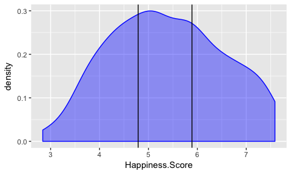
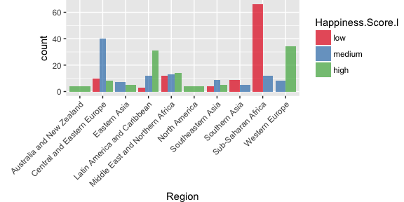
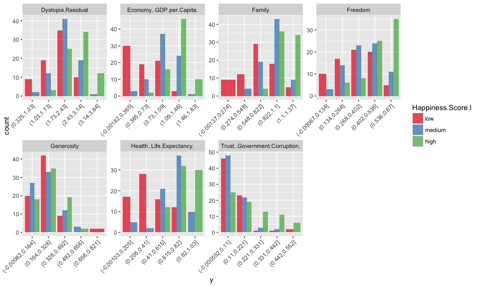
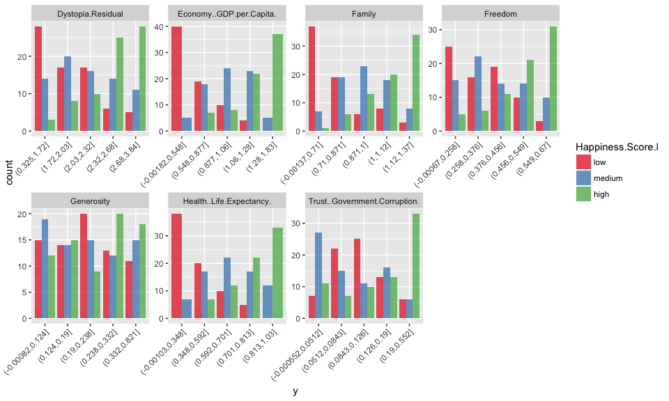
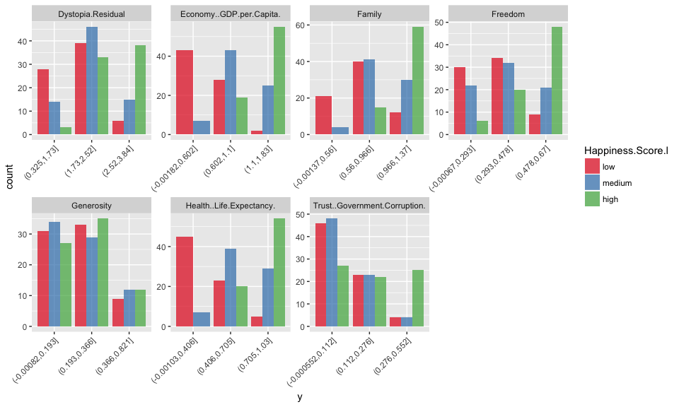
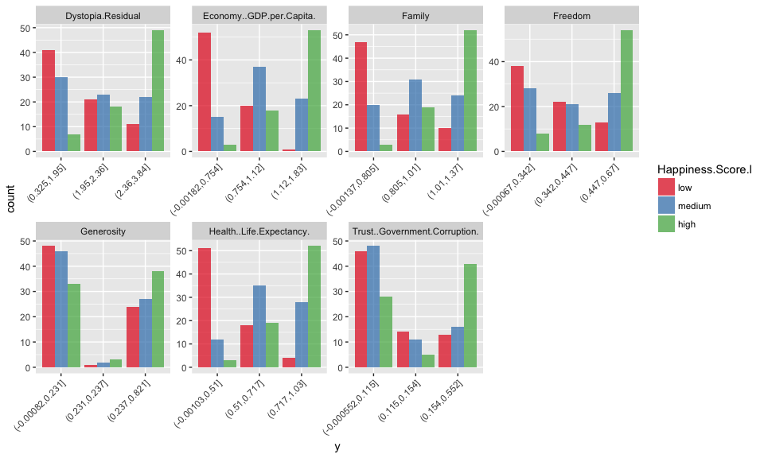
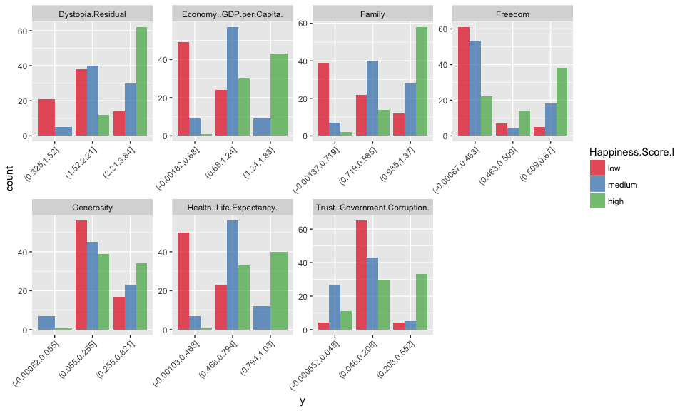
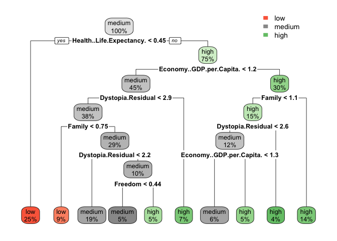
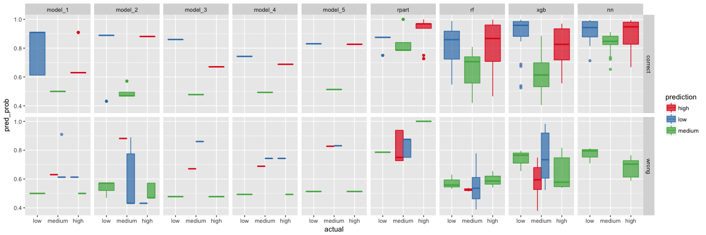

This week, I am exploring [Holger K. von Jouanne-Diedrich's OneR package](https://cran.r-project.org/web/packages/OneR/vignettes/OneR.html) for machine learning. I will run an example analysis and compare the prediction accuracy with other machine learning models (decision trees, random forest, gradient boosting trees and neural nets).

<br>

OneR
----

OneR has been developed for the purpose of creating machine learning models that are easy to interpret and understand, while still being as accurate as possible. It is based on the one rule classification algorithm from Holte (1993), which is basically a decision tree cut at the first level. While the original algorithm has difficulties in handling missing values and numeric data, the package provides enhanced functionality to handle those cases better, e.g. the optbin-function to find optimal splitting points for each feature and introducing a separate class for NA values. The main function of the package is OneR, which finds an optimal split for each feature and only use the most important feature with highest training accuracy for classification.

> [R.C. Holte (1993). Very simple classification rules perform well on most commonly used datasets. Machine Learning. 11:63-91.](http://www.mlpack.org/papers/ds.pdf)

<br>

I installed the lastest stable version of the **OneR** package from [CRAN](https://cran.r-project.org/package=OneR).

``` r
library(OneR)
```

<br>

The dataset
-----------

I am using the [**World Happiness Report 2016** from Kaggle](https://www.kaggle.com/unsdsn/world-happiness).

``` r
library(tidyverse)

data_16 <- read.table("world-happiness/2016.csv", sep = ",", header = TRUE)
data_15 <- read.table("world-happiness/2015.csv", sep = ",", header = TRUE)
```

In the 2016 data there are upper and lower CI for the happiness score given, while in the 2015 data we have standard errors. Because I want to combine data from the two years, I am using only columns that are in both datasets.

``` r
common_feats <- colnames(data_16)[which(colnames(data_16) %in% colnames(data_15))]

# features and response variable for modeling
feats <- setdiff(common_feats, c("Country", "Happiness.Rank", "Happiness.Score"))
response <- "Happiness.Score"

# combine data from 2015 and 2016
data_15_16 <- rbind(select(data_15, one_of(c(feats, response))),
              select(data_16, one_of(c(feats, response))))
```

The response variable **happiness score** is a numeric scale. OneR could also perform regression but here, I want to compare classification tasks. For classification, I want to create three bins for low, medium and high values. In order to not having to deal with unbalanced data, I am using the *bin()* function from OneR with `method = "content"`. For plotting the cut-points, I am extracting the numbers from the default level names.

``` r
data_15_16$Happiness.Score.l <- bin(data_15_16$Happiness.Score, nbins = 3, method = "content")

intervals <- paste(levels(data_15_16$Happiness.Score.l), collapse = " ")
intervals <- gsub("\\(|]", "", intervals)
intervals <- gsub(",", " ", intervals)
intervals <- as.numeric(unique(strsplit(intervals, " ")[[1]]))
```

``` r
data_15_16 %>%
  ggplot() +
    geom_density(aes(x = Happiness.Score), color = "blue", fill = "blue", alpha = 0.4) +
    geom_vline(xintercept = intervals[2]) +
    geom_vline(xintercept = intervals[3])
```



Now I am removing the original happiness score column from the data for modeling and rename the factor levels of the response variable.

``` r
data_15_16 <- select(data_15_16, -Happiness.Score) %>%
  mutate(Happiness.Score.l = plyr::revalue(Happiness.Score.l, c("(2.83,4.79]" = "low", "(4.79,5.89]" = "medium", "(5.89,7.59]" = "high")))
```

Because there are only 9 features in this small dataset, I want to explore them all individually before modeling. First, I am plotting the only categorical variable: Region.

This plots shows that there are a few regions with very strong biases in happiness: People in Western Europe, Australia, New Zealand, North America, Latin American and the Carribean tend to me in the high happiness group, while people in sub-saharan Africa and Southern Asia tend to be the least happiest.

``` r
data_15_16 %>%
  ggplot(aes(x = Region, fill = Happiness.Score.l)) +
    geom_bar(position = "dodge", alpha = 0.7) +
    theme(axis.text.x = element_text(angle = 45, vjust = 1, hjust = 1),
          plot.margin = unit(c(0, 0, 0, 1.5), "cm")) +
    scale_fill_brewer(palette = "Set1")
```



The remaining quantitative variables show happiness biases to varying degrees: e.g. low health and life expectancy is strongly biased towards low happiness, economic factors, family and freedom show a bias in the same direction, albeit not as strong.

``` r
data_15_16 %>%
  gather(x, y, Economy..GDP.per.Capita.:Dystopia.Residual) %>%
  ggplot(aes(x = y, fill = Happiness.Score.l)) +
    geom_histogram(alpha = 0.7) +
    facet_wrap(~ x, scales = "free", ncol = 4) +
    scale_fill_brewer(palette = "Set1")
```


While OneR could also handle categorical data, for this example, I only want to consider the quantitative features to show the differences between OneR and other machine learning algorithms.

``` r
data_15_16 <- select(data_15_16, -Region)
```

<br>

Modeling
--------

The algorithms I will compare to OneR will be run via the **caret** package.

``` r
# configure multicore
library(doParallel)
cl <- makeCluster(detectCores())
registerDoParallel(cl)

library(caret)
```

I will also use caret's *createDataPartition()* function to partition the data into training (70%) and test sets (30%).

``` r
set.seed(42)
index <- createDataPartition(data_15_16$Happiness.Score.l, p = 0.7, list = FALSE)
train_data <- data_15_16[index, ]
test_data  <- data_15_16[-index, ]
```

<br>

### OneR

OneR only accepts categorical features. Because we have numerical features, we need to convert them to factors by splitting them into appropriate bins. While the original OneR algorithm splits the values into ever smaller factors, this has been changed in this R-implementation with the argument of preventing overfitting. We can either split the data into pre-defined numbers of buckets (by length, content or cluster) or we can use the *optbin()* function to obtain the optimal number of factors from pairwise logistic regression or information gain.

``` r
# default method length
data_1 <- bin(train_data, nbins = 5, method = "length")

# method content
data_2 <- bin(train_data, nbins = 5, method = "content")

# method cluster
data_3 <- bin(train_data, nbins = 3, method = "cluster")

# optimal bin number logistic regression
data_4 <- optbin(formula = Happiness.Score.l ~., data = train_data, method = "logreg")

# optimal bin number information gain
data_5 <- optbin(formula = Happiness.Score.l ~., data = train_data, method = "infogain")
```

<br>

This is how the data looks like followed discretization:

-   Default method



<br>

-   5 bins with `method = "content`



<br>

-   3 bins with `method = "cluster`



<br>

-   optimal bin number according to logistic regression



<br>

-   optimal bin number according to information gain



<br>

### Model building

Now I am running the OneR models. During model building, the chosen attribute/feature with highest accuracy along with the top 7 features and accuracies are printed. Unfortunately, this information is not saved in the model object; this would have been nice in order to compare the importance of features across models later on.

Here, all five models achieved highest prediction accuracy with the feature Economy GDP per capita.

``` r
for (i in 1:5) {
  data <- get(paste0("data_", i))
  print(model <- OneR(formula = Happiness.Score.l ~., data = data, verbose = TRUE))
  assign(paste0("model_", i), model)
}
```

    ## 
    ##     Attribute                     Accuracy
    ## 1 * Economy..GDP.per.Capita.      63.96%  
    ## 2   Health..Life.Expectancy.      59.91%  
    ## 3   Family                        57.21%  
    ## 4   Dystopia.Residual             51.8%   
    ## 5   Freedom                       49.55%  
    ## 6   Trust..Government.Corruption. 45.5%   
    ## 7   Generosity                    41.89%  
    ## ---
    ## Chosen attribute due to accuracy
    ## and ties method (if applicable): '*'
    ## 
    ## 
    ## Call:
    ## OneR(data = data, formula = Happiness.Score.l ~ ., verbose = TRUE)
    ## 
    ## Rules:
    ## If Economy..GDP.per.Capita. = (-0.00182,0.365] then Happiness.Score.l = low
    ## If Economy..GDP.per.Capita. = (0.365,0.73]     then Happiness.Score.l = low
    ## If Economy..GDP.per.Capita. = (0.73,1.09]      then Happiness.Score.l = medium
    ## If Economy..GDP.per.Capita. = (1.09,1.46]      then Happiness.Score.l = high
    ## If Economy..GDP.per.Capita. = (1.46,1.83]      then Happiness.Score.l = high
    ## 
    ## Accuracy:
    ## 142 of 222 instances classified correctly (63.96%)
    ## 
    ## 
    ##     Attribute                     Accuracy
    ## 1 * Economy..GDP.per.Capita.      64.41%  
    ## 2   Health..Life.Expectancy.      60.81%  
    ## 3   Family                        59.91%  
    ## 4   Trust..Government.Corruption. 55.41%  
    ## 5   Freedom                       53.15%  
    ## 5   Dystopia.Residual             53.15%  
    ## 7   Generosity                    41.44%  
    ## ---
    ## Chosen attribute due to accuracy
    ## and ties method (if applicable): '*'
    ## 
    ## 
    ## Call:
    ## OneR(data = data, formula = Happiness.Score.l ~ ., verbose = TRUE)
    ## 
    ## Rules:
    ## If Economy..GDP.per.Capita. = (-0.00182,0.548] then Happiness.Score.l = low
    ## If Economy..GDP.per.Capita. = (0.548,0.877]    then Happiness.Score.l = low
    ## If Economy..GDP.per.Capita. = (0.877,1.06]     then Happiness.Score.l = medium
    ## If Economy..GDP.per.Capita. = (1.06,1.28]      then Happiness.Score.l = medium
    ## If Economy..GDP.per.Capita. = (1.28,1.83]      then Happiness.Score.l = high
    ## 
    ## Accuracy:
    ## 143 of 222 instances classified correctly (64.41%)
    ## 
    ## 
    ##     Attribute                     Accuracy
    ## 1 * Economy..GDP.per.Capita.      63.51%  
    ## 2   Health..Life.Expectancy.      62.16%  
    ## 3   Family                        54.5%   
    ## 4   Freedom                       50.45%  
    ## 4   Dystopia.Residual             50.45%  
    ## 6   Trust..Government.Corruption. 43.24%  
    ## 7   Generosity                    36.49%  
    ## ---
    ## Chosen attribute due to accuracy
    ## and ties method (if applicable): '*'
    ## 
    ## 
    ## Call:
    ## OneR(data = data, formula = Happiness.Score.l ~ ., verbose = TRUE)
    ## 
    ## Rules:
    ## If Economy..GDP.per.Capita. = (-0.00182,0.602] then Happiness.Score.l = low
    ## If Economy..GDP.per.Capita. = (0.602,1.1]      then Happiness.Score.l = medium
    ## If Economy..GDP.per.Capita. = (1.1,1.83]       then Happiness.Score.l = high
    ## 
    ## Accuracy:
    ## 141 of 222 instances classified correctly (63.51%)
    ## 
    ## 
    ##     Attribute                     Accuracy
    ## 1 * Economy..GDP.per.Capita.      63.96%  
    ## 2   Health..Life.Expectancy.      62.16%  
    ## 3   Family                        58.56%  
    ## 4   Freedom                       51.35%  
    ## 5   Dystopia.Residual             50.9%   
    ## 6   Trust..Government.Corruption. 46.4%   
    ## 7   Generosity                    40.09%  
    ## ---
    ## Chosen attribute due to accuracy
    ## and ties method (if applicable): '*'
    ## 
    ## 
    ## Call:
    ## OneR(data = data, formula = Happiness.Score.l ~ ., verbose = TRUE)
    ## 
    ## Rules:
    ## If Economy..GDP.per.Capita. = (-0.00182,0.754] then Happiness.Score.l = low
    ## If Economy..GDP.per.Capita. = (0.754,1.12]     then Happiness.Score.l = medium
    ## If Economy..GDP.per.Capita. = (1.12,1.83]      then Happiness.Score.l = high
    ## 
    ## Accuracy:
    ## 142 of 222 instances classified correctly (63.96%)
    ## 
    ## 
    ##     Attribute                     Accuracy
    ## 1 * Economy..GDP.per.Capita.      67.12%  
    ## 2   Health..Life.Expectancy.      65.77%  
    ## 3   Family                        61.71%  
    ## 4   Trust..Government.Corruption. 56.31%  
    ## 5   Dystopia.Residual             55.41%  
    ## 6   Freedom                       50.9%   
    ## 7   Generosity                    43.69%  
    ## ---
    ## Chosen attribute due to accuracy
    ## and ties method (if applicable): '*'
    ## 
    ## 
    ## Call:
    ## OneR(data = data, formula = Happiness.Score.l ~ ., verbose = TRUE)
    ## 
    ## Rules:
    ## If Economy..GDP.per.Capita. = (-0.00182,0.68] then Happiness.Score.l = low
    ## If Economy..GDP.per.Capita. = (0.68,1.24]     then Happiness.Score.l = medium
    ## If Economy..GDP.per.Capita. = (1.24,1.83]     then Happiness.Score.l = high
    ## 
    ## Accuracy:
    ## 149 of 222 instances classified correctly (67.12%)

<br>

### Model evaluation

The function *eval\_model()* prints confusion matrices for absolute and relative predictions, as well as accuracy, error and error rate reduction. For comparison with other models, I would have been convenient to be able to extract these performance metrics directly from the eval\_model object, instead of only the confusion matrix and values of correct/all instances and having to re-calculate them again manually.

``` r
for (i in 1:5) {
  model <- get(paste0("model_", i))
  eval_model(predict(model, test_data), test_data$Happiness.Score.l)
}
```

    ## 
    ## Confusion matrix (absolute):
    ##           Actual
    ## Prediction high low medium Sum
    ##     high     23   0     11  34
    ##     low       1  26     10  37
    ##     medium    7   5     10  22
    ##     Sum      31  31     31  93
    ## 
    ## Confusion matrix (relative):
    ##           Actual
    ## Prediction high  low medium  Sum
    ##     high   0.25 0.00   0.12 0.37
    ##     low    0.01 0.28   0.11 0.40
    ##     medium 0.08 0.05   0.11 0.24
    ##     Sum    0.33 0.33   0.33 1.00
    ## 
    ## Accuracy:
    ## 0.6344 (59/93)
    ## 
    ## Error rate:
    ## 0.3656 (34/93)
    ## 
    ## Error rate reduction (vs. base rate):
    ## 0.4516 (p-value = 2.855e-09)
    ## 
    ## 
    ## Confusion matrix (absolute):
    ##           Actual
    ## Prediction high low medium Sum
    ##     high     19   0      1  20
    ##     low       3  28     14  45
    ##     medium    9   3     16  28
    ##     Sum      31  31     31  93
    ## 
    ## Confusion matrix (relative):
    ##           Actual
    ## Prediction high  low medium  Sum
    ##     high   0.20 0.00   0.01 0.22
    ##     low    0.03 0.30   0.15 0.48
    ##     medium 0.10 0.03   0.17 0.30
    ##     Sum    0.33 0.33   0.33 1.00
    ## 
    ## Accuracy:
    ## 0.6774 (63/93)
    ## 
    ## Error rate:
    ## 0.3226 (30/93)
    ## 
    ## Error rate reduction (vs. base rate):
    ## 0.5161 (p-value = 1.303e-11)
    ## 
    ## 
    ## Confusion matrix (absolute):
    ##           Actual
    ## Prediction high low medium Sum
    ##     high     23   0     11  34
    ##     low       0  25      7  32
    ##     medium    8   6     13  27
    ##     Sum      31  31     31  93
    ## 
    ## Confusion matrix (relative):
    ##           Actual
    ## Prediction high  low medium  Sum
    ##     high   0.25 0.00   0.12 0.37
    ##     low    0.00 0.27   0.08 0.34
    ##     medium 0.09 0.06   0.14 0.29
    ##     Sum    0.33 0.33   0.33 1.00
    ## 
    ## Accuracy:
    ## 0.6559 (61/93)
    ## 
    ## Error rate:
    ## 0.3441 (32/93)
    ## 
    ## Error rate reduction (vs. base rate):
    ## 0.4839 (p-value = 2.116e-10)
    ## 
    ## 
    ## Confusion matrix (absolute):
    ##           Actual
    ## Prediction high low medium Sum
    ##     high     23   0     11  34
    ##     low       2  26     11  39
    ##     medium    6   5      9  20
    ##     Sum      31  31     31  93
    ## 
    ## Confusion matrix (relative):
    ##           Actual
    ## Prediction high  low medium  Sum
    ##     high   0.25 0.00   0.12 0.37
    ##     low    0.02 0.28   0.12 0.42
    ##     medium 0.06 0.05   0.10 0.22
    ##     Sum    0.33 0.33   0.33 1.00
    ## 
    ## Accuracy:
    ## 0.6237 (58/93)
    ## 
    ## Error rate:
    ## 0.3763 (35/93)
    ## 
    ## Error rate reduction (vs. base rate):
    ## 0.4355 (p-value = 9.799e-09)
    ## 
    ## 
    ## Confusion matrix (absolute):
    ##           Actual
    ## Prediction high low medium Sum
    ##     high     21   0      3  24
    ##     low       0  26      8  34
    ##     medium   10   5     20  35
    ##     Sum      31  31     31  93
    ## 
    ## Confusion matrix (relative):
    ##           Actual
    ## Prediction high  low medium  Sum
    ##     high   0.23 0.00   0.03 0.26
    ##     low    0.00 0.28   0.09 0.37
    ##     medium 0.11 0.05   0.22 0.38
    ##     Sum    0.33 0.33   0.33 1.00
    ## 
    ## Accuracy:
    ## 0.7204 (67/93)
    ## 
    ## Error rate:
    ## 0.2796 (26/93)
    ## 
    ## Error rate reduction (vs. base rate):
    ## 0.5806 (p-value = 2.761e-14)

Because I want to calculate performance measures for the different classes separately and like to have a more detailed look at the prediction probabilities I get from the models, I prefer to obtain predictions with `type = "prob`. While I am not looking at it here, this would also allow me to test different prediction thresholds.

``` r
for (i in 1:5) {
  model <- get(paste0("model_", i))
  pred <- data.frame(model = paste0("model_", i),
                     sample_id = 1:nrow(test_data),
                     predict(model, test_data, type = "prob"),
                     actual = test_data$Happiness.Score.l)
  pred$prediction <- colnames(pred)[3:5][apply(pred[, 3:5], 1, which.max)]
  pred$correct <- ifelse(pred$actual == pred$prediction, "correct", "wrong")
  pred$pred_prob <- NA
  
  for (j in 1:nrow(pred)) {
    pred[j, "pred_prob"] <- max(pred[j, 3:5])
  }
  
  if (i == 1) {
    pred_df <- pred
  } else {
    pred_df <- rbind(pred_df, pred)
  }
}
```

<br>

### Comparing other algorithms

#### Decision trees

First, I am building a decision tree with the **rpart** package and *rpart()* function. This, we can plot with *rpart.plot()*.

Economy GDP per capita is the second highest node here, the best predictor here would be health and life expectancy.

``` r
library(rpart)
library(rpart.plot)

set.seed(42)
fit <- rpart(Happiness.Score.l ~ .,
            data = train_data,
            method = "class",
            control = rpart.control(xval = 10), 
            parms = list(split = "information"))

rpart.plot(fit, extra = 100)
```



In order to compare the models, I am producing the same output table for predictions from this model and combine it with the table from the OneR models.

``` r
pred <- data.frame(model = "rpart",
                   sample_id = 1:nrow(test_data),
                   predict(fit, test_data, type = "prob"),
                   actual = test_data$Happiness.Score.l)
  pred$prediction <- colnames(pred)[3:5][apply(pred[, 3:5], 1, which.max)]
  pred$correct <- ifelse(pred$actual == pred$prediction, "correct", "wrong")
  pred$pred_prob <- NA
  
  for (j in 1:nrow(pred)) {
    pred[j, "pred_prob"] <- max(pred[j, 3:5])
  }
```

``` r
pred_df_final <- rbind(pred_df,
                       pred)
```

<br>

### Random Forest

Next, I am training a Random Forest model. For more details on Random Forest, check out my [post "Can we predict flu deaths with Machine Learning and R?"](https://shiring.github.io/machine_learning/2016/11/27/flu_outcome_ML_post).

``` r
set.seed(42)
model_rf <- caret::train(Happiness.Score.l ~ .,
                         data = train_data,
                         method = "rf",
                         trControl = trainControl(method = "repeatedcv", 
                                                  number = 10, 
                                                  repeats = 5, 
                                                  verboseIter = FALSE))
```

The *varImp()* function from caret shows us which feature was of highest importance for the model and its predictions.

Here, we again find Economy GDP per captia on top.

``` r
varImp(model_rf)
```

    ## rf variable importance
    ## 
    ##                               Overall
    ## Economy..GDP.per.Capita.       100.00
    ## Dystopia.Residual               97.89
    ## Health..Life.Expectancy.        77.10
    ## Family                          47.17
    ## Trust..Government.Corruption.   29.89
    ## Freedom                         19.29
    ## Generosity                       0.00

``` r
pred <- data.frame(model = "rf",
                   sample_id = 1:nrow(test_data),
                   predict(model_rf, test_data, type = "prob"),
                   actual = test_data$Happiness.Score.l)
  pred$prediction <- colnames(pred)[3:5][apply(pred[, 3:5], 1, which.max)]
  pred$correct <- ifelse(pred$actual == pred$prediction, "correct", "wrong")
  pred$pred_prob <- NA
  
  for (j in 1:nrow(pred)) {
    pred[j, "pred_prob"] <- max(pred[j, 3:5])
  }
```

``` r
pred_df_final <- rbind(pred_df_final,
                       pred)
```

<br>

### Extreme gradient boosting trees

Gradient boosting is another decision tree-based algorithm, explained in more detail in [my post "Extreme Gradient Boosting and Preprocessing in Machine Learning"](https://shiring.github.io/machine_learning/2016/12/02/flu_outcome_ML_2_post).

``` r
set.seed(42)
model_xgb <- caret::train(Happiness.Score.l ~ .,
                         data = train_data,
                         method = "xgbTree",
                         trControl = trainControl(method = "repeatedcv", 
                                                  number = 10, 
                                                  repeats = 5, 
                                                  verboseIter = FALSE))
```

As before, we again find Economy GDP per capita as most important feature.

``` r
varImp(model_xgb)
```

    ## xgbTree variable importance
    ## 
    ##                          Overall
    ## Economy..GDP.per.Capita.  100.00
    ## Health..Life.Expectancy.   67.43
    ## Family                     46.59
    ## Freedom                     0.00

``` r
pred <- data.frame(model = "xgb",
                   sample_id = 1:nrow(test_data),
                   predict(model_xgb, test_data, type = "prob"),
                   actual = test_data$Happiness.Score.l)
  pred$prediction <- colnames(pred)[3:5][apply(pred[, 3:5], 1, which.max)]
  pred$correct <- ifelse(pred$actual == pred$prediction, "correct", "wrong")
  pred$pred_prob <- NA
  
  for (j in 1:nrow(pred)) {
    pred[j, "pred_prob"] <- max(pred[j, 3:5])
  }
```

``` r
pred_df_final <- rbind(pred_df_final,
                       pred)
```

<br>

### Neural network

Finally, I am comparing a neural network model. Here as well, I have a post where I talk about what they are in more detail: ["Building deep neural nets with h2o and rsparkling that predict arrhythmia of the heart"](https://shiring.github.io/machine_learning/2017/02/27/h2o).

``` r
set.seed(42)
model_nn <- caret::train(Happiness.Score.l ~ .,
                         data = train_data,
                         method = "mlp",
                         trControl = trainControl(method = "repeatedcv", 
                                                  number = 10, 
                                                  repeats = 5, 
                                                  verboseIter = FALSE))
```

And Economy GDP per capita is again the most important feature!

``` r
varImp(model_nn)
```

    ## ROC curve variable importance
    ## 
    ##   variables are sorted by maximum importance across the classes
    ##                                  low medium    high
    ## Economy..GDP.per.Capita.      100.00 66.548 100.000
    ## Health..Life.Expectancy.       95.22 63.632  95.222
    ## Family                         84.48 45.211  84.483
    ## Dystopia.Residual              71.23 43.450  71.232
    ## Freedom                        64.58 41.964  64.581
    ## Trust..Government.Corruption.  26.13 40.573  40.573
    ## Generosity                      0.00  3.462   3.462

``` r
pred <- data.frame(model = "nn",
                   sample_id = 1:nrow(test_data),
                   predict(model_nn, test_data, type = "prob"),
                   actual = test_data$Happiness.Score.l)
  pred$prediction <- colnames(pred)[3:5][apply(pred[, 3:5], 1, which.max)]
  pred$correct <- ifelse(pred$actual == pred$prediction, "correct", "wrong")
  pred$pred_prob <- NA
  
  for (j in 1:nrow(pred)) {
    pred[j, "pred_prob"] <- max(pred[j, 3:5])
  }
```

``` r
pred_df_final <- rbind(pred_df_final,
                       pred)
```

<br>

Model comparisons
-----------------

Now to the final verdict: How do the different models compare?

The first plot below shows the prediction probabilites for the three happiness levels low, medium and high for each test data instance. For each instance, only the prediction probability of the predicted class (i.e. with the highest value) is shown. The upper row shows correct predictions, the lower row shows wrong predictions.

Sometimes, it is obvious from such a plot if a more stringent prediction threshold could improve things (when wrong predictions tend to be close to the threshold). With three classes to predict, this is obviously not as trivial as if we only had two but the same principle holds true: the smaller the prediction probability, the more uncertain it tends to be.

``` r
pred_df_final %>%
  ggplot(aes(x = actual, y = pred_prob, fill = prediction, color = prediction)) +
    geom_boxplot(alpha = 0.7) +
    facet_grid(correct ~ model) +
    scale_color_brewer(palette = "Set1") +
    scale_fill_brewer(palette = "Set1")
```



Probably the most straight-forwards performance measure is accuracy: i.e. the proportion of correct predictions vs the total number of instances to predict. The closer to 1, the better the accuracy.

Not surprisingly, the more complex models tend to be more accurate - albeit only slightly.

``` r
pred_df_final %>%
  group_by(model) %>%
  dplyr::summarise(correct = sum(correct == "correct")) %>%
  mutate(accuracy = correct / nrow(test_data)) %>%
  ggplot(aes(x = model, y = accuracy, fill = model)) +
    geom_bar(stat = "identity") +
    scale_fill_brewer(palette = "Set1")
```


When we look at the three classes individually, it looks a bit more complicated but all models, except the neural network, achieved best accuracy for high happiness instances and worst for medium.

``` r
pred_df_final %>%
  group_by(model, actual) %>%
  dplyr::summarise(correct = sum(correct == "correct"),
            n = n()) %>%
  mutate(accuracy = correct / n) %>%
  ggplot(aes(x = model, y = accuracy, fill = actual)) +
    geom_bar(stat = "identity", position = "dodge") +
    scale_fill_brewer(palette = "Set1")
```


``` r
pred_df_final %>%
  group_by(model, prediction) %>%
  dplyr::summarise(correct = sum(correct == "correct"),
            n = n()) %>%
  mutate(accuracy = correct / n) %>%
  ggplot(aes(x = model, y = accuracy, fill = prediction)) +
    geom_bar(stat = "identity", position = "dodge") +
    scale_fill_brewer(palette = "Set1")
```


<br>

Conclusions
-----------

All in all, based on this example, I would confirm that OneR models do indeed produce sufficiently accurate models for setting a good baseline. OneR was definitely faster than random forest, gradient boosting and neural nets. However, the latter were more complex models and included cross-validation.

If you prefer an easy to understand model that is very simple, OneR is a very good way to go. You could also use it as a starting point for developing more complex models with improved accuracy.

------------------------------------------------------------------------

If you are interested in more machine learning posts, check out [the category listing for **machine\_learning** on my blog](https://shiring.github.io/categories.html#machine_learning-ref).

------------------------------------------------------------------------

``` r
sessionInfo()
```

    ## R version 3.3.3 (2017-03-06)
    ## Platform: x86_64-apple-darwin13.4.0 (64-bit)
    ## Running under: macOS Sierra 10.12.3
    ## 
    ## locale:
    ## [1] en_US.UTF-8/en_US.UTF-8/en_US.UTF-8/C/en_US.UTF-8/en_US.UTF-8
    ## 
    ## attached base packages:
    ## [1] parallel  stats     graphics  grDevices utils     datasets  methods  
    ## [8] base     
    ## 
    ## other attached packages:
    ##  [1] RSNNS_0.4-9         Rcpp_0.12.10        plyr_1.8.4         
    ##  [4] xgboost_0.6-4       randomForest_4.6-12 rpart.plot_2.1.1   
    ##  [7] rpart_4.1-10        caret_6.0-73        lattice_0.20-35    
    ## [10] doParallel_1.0.10   iterators_1.0.8     foreach_1.4.3      
    ## [13] dplyr_0.5.0         purrr_0.2.2         readr_1.1.0        
    ## [16] tidyr_0.6.1         tibble_1.3.0        ggplot2_2.2.1      
    ## [19] tidyverse_1.1.1     OneR_2.1           
    ## 
    ## loaded via a namespace (and not attached):
    ##  [1] lubridate_1.6.0    assertthat_0.2.0   rprojroot_1.2     
    ##  [4] digest_0.6.12      psych_1.7.3.21     R6_2.2.0          
    ##  [7] backports_1.0.5    MatrixModels_0.4-1 stats4_3.3.3      
    ## [10] evaluate_0.10      httr_1.2.1         lazyeval_0.2.0    
    ## [13] readxl_0.1.1       data.table_1.10.4  minqa_1.2.4       
    ## [16] SparseM_1.76       car_2.1-4          nloptr_1.0.4      
    ## [19] Matrix_1.2-8       rmarkdown_1.4      labeling_0.3      
    ## [22] splines_3.3.3      lme4_1.1-12        stringr_1.2.0     
    ## [25] foreign_0.8-67     munsell_0.4.3      broom_0.4.2       
    ## [28] modelr_0.1.0       mnormt_1.5-5       mgcv_1.8-17       
    ## [31] htmltools_0.3.5    nnet_7.3-12        codetools_0.2-15  
    ## [34] MASS_7.3-45        ModelMetrics_1.1.0 grid_3.3.3        
    ## [37] nlme_3.1-131       jsonlite_1.4       gtable_0.2.0      
    ## [40] DBI_0.6-1          magrittr_1.5       scales_0.4.1      
    ## [43] stringi_1.1.5      reshape2_1.4.2     xml2_1.1.1        
    ## [46] RColorBrewer_1.1-2 tools_3.3.3        forcats_0.2.0     
    ## [49] hms_0.3            pbkrtest_0.4-7     yaml_2.1.14       
    ## [52] colorspace_1.3-2   rvest_0.3.2        knitr_1.15.1      
    ## [55] haven_1.0.0        quantreg_5.29
